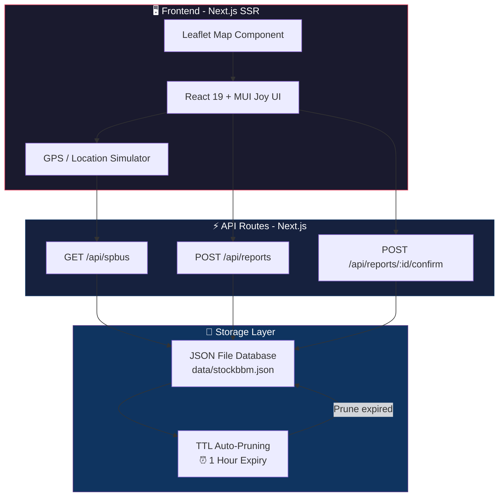
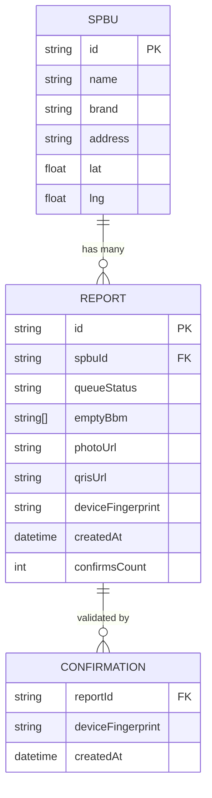
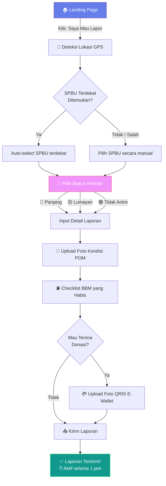
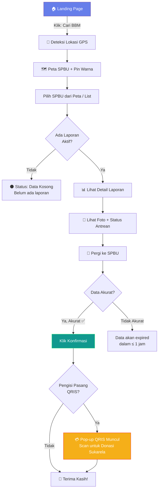
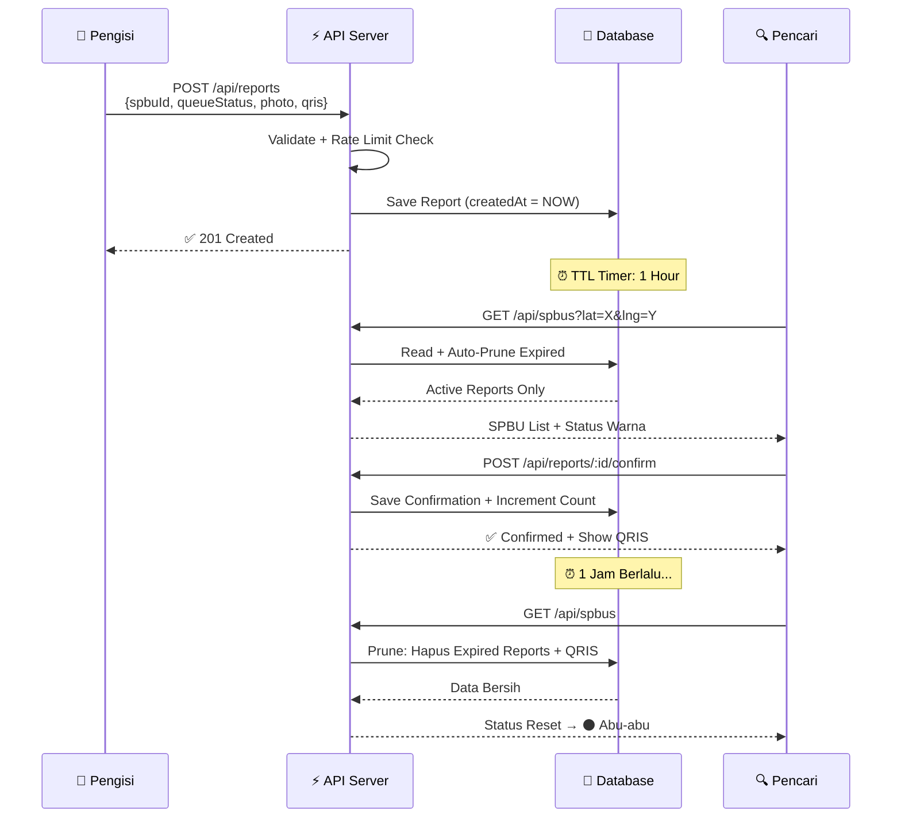
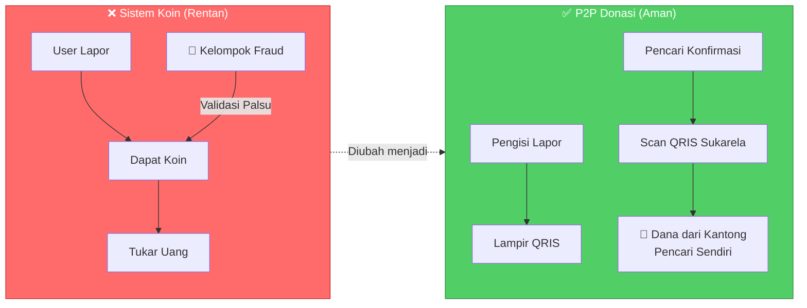

<](https://nextjs.org/)
[](https://react.dev/)
[](https://leafletjs.com/)
[](https://mui.com/joy-ui/)
[](#license)

**Sistem pemantauan antrean dan ketersediaan BBM di SPBU berbasis *crowdsourcing* peer-to-peer — tanpa registrasi, tanpa login, tanpa ribet.**

[Demo](#demo) · [Arsitektur](#-arsitektur-sistem) · [API Reference](#-api-reference) · [Setup](#-getting-started)

</div>

---

## 📋 Daftar Isi

- [Tentang Proyek](#-tentang-proyek)
- [Fitur Utama](#-fitur-utama)
- [Arsitektur Sistem](#-arsitektur-sistem)
- [User Flow](#-user-flow)
- [Tech Stack](#-tech-stack)
- [Struktur Direktori](#-struktur-direktori)
- [API Reference](#-api-reference)
- [Anti-Fraud System](#-anti-fraud-system)
- [Getting Started](#-getting-started)
- [Deployment](#-deployment)
- [License](#license)

---

## 💡 Tentang Proyek

StockBBM memecahkan masalah klasik bagi pengendara di Indonesia: **"SPBU mana yang antreannya pendek dan stok BBM-nya masih ada?"**

Sistem ini dirancang **100% stateless** (tanpa registrasi/login) untuk memangkas *friction* pengguna saat berada di lapangan. Data dilaporkan secara *crowdsource* oleh pengguna lain dan memiliki masa aktif **1 jam** (TTL) agar tetap akurat secara *real-time*.

Sebagai bentuk apresiasi, sistem menyediakan mekanisme **donasi P2P sukarela** — pencari BBM dapat langsung men-scan QRIS milik si pelapor sebagai ucapan terima kasih. Pendekatan ini sekaligus mengeliminasi celah kecurangan (*Sybil Attack / Circle Fraud*) yang umum terjadi pada sistem gamifikasi berbasis koin.

---

## ✨ Fitur Utama

| Fitur | Deskripsi |
|---|---|
| 🗺️ **Peta Interaktif** | Peta Leaflet real-time dengan pin SPBU berwarna sesuai kondisi antrean |
| 📍 **Geo-Filtering** | Deteksi lokasi GPS + simulasi lokasi preset untuk demo/testing |
| 🚦 **Status Antrean** | Tiga indikator: 🔴 Panjang · 🟡 Lumayan · 🟢 Tidak Antre |
| 📸 **Foto Bukti** | Upload foto kondisi SPBU langsung dari kamera/galeri |
| 💳 **QRIS P2P Donasi** | Pengisi lampirkan QRIS → Pencari scan langsung sebagai tip sukarela |
| ⏰ **TTL 1 Jam** | Laporan auto-expired setelah 1 jam, menjaga akurasi data |
| ✅ **Social Proof** | Pencari konfirmasi akurasi → meningkatkan kepercayaan data |
| 🛡️ **Anti-Fraud** | Rate limiting + device fingerprint, tanpa insentif untuk manipulasi |
| 🌗 **Dark/Light Mode** | Toggle tema otomatis mengikuti preferensi sistem |

---

## 🏗 Arsitektur Sistem

### High-Level Architecture



### Data Model



---

## 🔄 User Flow

### Flow Pengisi (Data Provider)



### Flow Pencari (Data Consumer)



### Siklus Hidup Data (TTL Lifecycle)



---

## 🛠 Tech Stack

| Layer | Teknologi | Fungsi |
|---|---|---|
| **Framework** | Next.js 16 (App Router) | SSR, API Routes, Routing |
| **UI Library** | React 19 | Component rendering |
| **Component Kit** | MUI Joy UI | Dialog, Card, Button, Sheet |
| **Maps** | Leaflet.js | Interactive map + Geo markers |
| **Icons** | React Icons (Font Awesome) | UI iconography |
| **Styling** | Emotion CSS-in-JS | Theming + Dynamic styles |
| **Database** | JSON File (TTL auto-prune) | Persistent storage with auto-cleanup |
| **Language** | TypeScript | Type safety across stack |

---

## 📂 Struktur Direktori

```
pom-watch/
├── app/
│   ├── api/
│   │   ├── spbus/
│   │   │   └── route.ts           # GET  - Fetch SPBUs + status + distance
│   │   └── reports/
│   │       ├── route.ts           # POST - Submit new report
│   │       └── [id]/
│   │           └── confirm/
│   │               └── route.ts   # POST - Confirm report accuracy
│   ├── page.tsx                   # Main SPA (Home → Pengisi / Pencari)
│   ├── layout.tsx                 # Root layout + metadata
│   ├── ThemeRegistry.tsx          # MUI Joy theme provider (dark/light)
│   └── globals.css                # Global styles + Leaflet pulse animation
│
├── components/
│   └── MapComponent.tsx           # Leaflet map with dynamic markers
│
├── lib/
│   └── db.ts                     # JSON database with TTL auto-prune
│
├── data/
│   └── stockbbm.json             # Persistent data store (auto-generated)
│
├── public/                       # Static assets
├── AGENTS.md                     # Project specification / rules
├── package.json
├── tsconfig.json
└── next.config.ts
```

---

## 📡 API Reference

### `GET /api/spbus`

Mengambil daftar SPBU beserta status laporan aktif. Otomatis prune data expired (>1 jam).

**Query Parameters:**

| Parameter | Type | Required | Description |
|---|---|---|---|
| `lat` | `float` | No | Latitude user untuk kalkulasi jarak |
| `lng` | `float` | No | Longitude user untuk kalkulasi jarak |

**Headers:**

| Header | Type | Required | Description |
|---|---|---|---|
| `x-device-fingerprint` | `string` | No | Device ID untuk cek status konfirmasi |

**Response `200 OK`:**

```json
[
  {
    "id": "spbu-1",
    "name": "SPBU Pertamina 54.613.01 Bypass",
    "brand": "Pertamina",
    "address": "Jl. Raya By Pass, Kel. Kedundung...",
    "lat": -7.4815,
    "lng": 112.4286,
    "distanceKm": 2.34,
    "activeReport": {
      "id": "uuid-xxx",
      "queueStatus": "yellow",
      "emptyBbm": ["Pertalite"],
      "photoUrl": "data:image/jpeg;base64,...",
      "qrisUrl": "data:image/jpeg;base64,...",
      "confirmsCount": 3,
      "hasConfirmed": false,
      "createdAt": "2026-06-15T12:00:00.000Z"
    }
  }
]
```

---

### `POST /api/reports`

Mengirimkan laporan kondisi SPBU baru.

**Headers (Required):**

| Header | Type | Description |
|---|---|---|
| `x-device-fingerprint` | `string` | Unique device identifier |

**Request Body:**

```json
{
  "spbuId": "spbu-1",
  "queueStatus": "red",
  "emptyBbm": ["Pertalite", "Pertamax"],
  "photoUrl": "data:image/jpeg;base64,...",
  "qrisUrl": "data:image/jpeg;base64,..."
}
```

| Field | Type | Required | Description |
|---|---|---|---|
| `spbuId` | `string` | ✅ | ID SPBU target |
| `queueStatus` | `enum` | ✅ | `"red"` / `"yellow"` / `"green"` |
| `emptyBbm` | `string[]` | No | Daftar BBM yang habis |
| `photoUrl` | `string` | No | Foto kondisi POM (base64) |
| `qrisUrl` | `string` | No | Foto QRIS donasi (base64) |

**Response `201 Created`:**

```json
{
  "id": "uuid-generated",
  "spbuId": "spbu-1",
  "queueStatus": "red",
  "emptyBbm": ["Pertalite"],
  "createdAt": "2026-06-15T12:00:00.000Z",
  "confirmsCount": 0
}
```

**Error Responses:**

| Code | Condition |
|---|---|
| `400` | Missing fingerprint atau invalid queueStatus |
| `404` | SPBU ID tidak ditemukan |
| `429` | Rate limited — sudah lapor di SPBU ini < 30 menit lalu |

---

### `POST /api/reports/:id/confirm`

Konfirmasi akurasi sebuah laporan (social proof).

**Headers (Required):**

| Header | Type | Description |
|---|---|---|
| `x-device-fingerprint` | `string` | Unique device identifier |

**Response `200 OK`:** Updated report object dengan `confirmsCount` yang bertambah.

**Error Responses:**

| Code | Condition |
|---|---|
| `400` | Missing fingerprint / sudah pernah konfirmasi |
| `404` | Report tidak ditemukan atau sudah expired |

---

## 🛡 Anti-Fraud System

### Masalah: Sybil Attack / Circle Fraud

Pada sistem gamifikasi tradisional (koin/poin), sekelompok pengguna bisa bersekongkol memvalidasi data palsu untuk mendapatkan reward. Contoh: rombongan touring yang saling validasi laporan fiktif.

### Solusi StockBBM



| Layer | Mekanisme | Detail |
|---|---|---|
| **1. Zero Incentive** | P2P Donasi Sukarela | Tidak ada koin/reward dari sistem. Dana keluar langsung dari kantong pencari → tidak ada motivasi untuk fraud |
| **2. Device Tracking** | Fingerprint + Rate Limit | 1 laporan per SPBU per device per 30 menit. Header `x-device-fingerprint` wajib disertakan |
| **3. Data Hygiene** | TTL Auto-Prune 1 Jam | Laporan + QRIS otomatis dihapus setelah 1 jam. Tidak ada penumpukan *stale data* |
| **4. Social Proof** | Konfirmasi 1x per Device | 1 device hanya bisa konfirmasi 1 laporan 1x. Mencegah spam validasi |

---

## 🚀 Getting Started

### Prerequisites

- **Node.js** ≥ 18.x
- **npm** ≥ 9.x

### Installation

```bash
# 1. Clone repository
git clone https://github.com/RayhanDitaAdam/StockBBM.git
cd StockBBM

# 2. Install dependencies
npm install

# 3. Jalankan development server
npm run dev
```

Server berjalan di `http://localhost:3000`

### Environment Variables (Optional)

Buat file `.env.local` jika dibutuhkan:

```env
# Tidak ada environment variable wajib untuk mode local
# Database otomatis terbuat di data/stockbbm.json
```

### Simulasi Lokasi

Aplikasi menyediakan **preset lokasi** untuk testing tanpa GPS asli:

| Preset | Kota | Koordinat |
|---|---|---|
| Mojokerto (Default) | Jawa Timur | -7.4815, 112.4286 |
| Jakarta | DKI Jakarta | -6.1627, 106.8322 |
| Bandung | Jawa Barat | -6.9378, 107.6186 |
| Pekanbaru | Riau | 0.5186, 101.4398 |
| Balikpapan | Kalimantan Timur | -1.2464, 116.8430 |
| Aceh Singkil | Aceh | 2.3789, 98.0125 |

---

## 🌐 Deployment

### Deploy ke VPS

```bash
# Build production
npm run build

# Start production server
npm start
```

### Deploy ke Vercel

```bash
# Install Vercel CLI
npm i -g vercel

# Deploy
vercel --prod
```

> **Note:** Pada Vercel (serverless), database JSON file bersifat *ephemeral* — data akan reset setiap deployment baru. Untuk persistence di production, disarankan migrasi ke MongoDB atau PostgreSQL.

---

## 📊 Indikator Warna Pin Maps

| Warna | Status | Arti |
|---|---|---|
| 🟢 Hijau | `green` | Tidak ada antrean, stok BBM lengkap |
| 🟡 Kuning | `yellow` | Antrean lumayan, stok masih ada |
| 🔴 Merah | `red` | Antrean panjang / stok menipis |
| ⚫ Abu-abu | — | Belum ada laporan / data expired |
| 🔵 Biru (dot) | — | Lokasi anda saat ini |

---

## License

Distributed under the MIT License. See `LICENSE` for more information.

---

<div align="center">

**Built with ☕ and gotong-royong**

*StockBBM — Karena antre BBM nggak harus buta informasi.*

</div>
]]>
